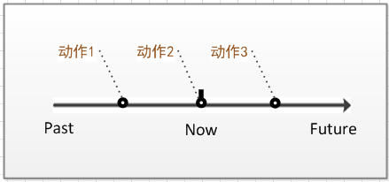
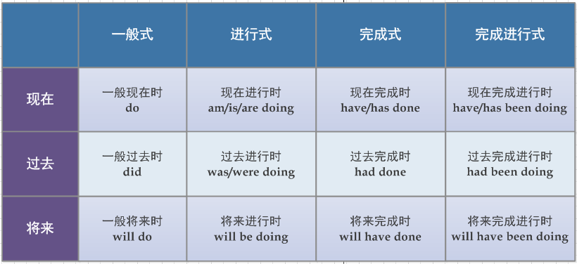
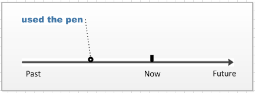

## 时态
时态就是表示一个动作发生的`时间`和所处的`状态`。
* 时间的定义

也就是过去现在和将来
* 状态的定义 
    * 一般式(一般式表示经常发生的动作，其动词形式为do)
        * I often get up at 7(我经常7点起床)
    * 进行式(表示正在进行的动作 be动词+doing)
        * She is singing a French song(他正在唱法语歌)
    * 完成式(表示对之前发生的动作的总结,have + done)
        * They have found the missing child(他们已经找到了丢失的孩子)
    * 进行完成式(表示对正在进行的动作的总结,have + been + doing)
        * I have been reading books for two hours(我已经读了两个小时的书了)
        

## 动词的十二种时态
* 一般现在时（do）
    * 除了表示经常发生的动作外，一般现在时还可以用来表示客观事实。
    * Light travels more quickly than sound.
* 一般过去时（did）
    * 一般过去时表示某个过去的时间点所发生的动作

* 一般将来时（will do）
    * 一般将来时表示某个将来的时间点会发生的动作。

* 现在进行时（am/is/are doing）

  * 表示现在正在进行的动作，必定会延续一段时间

* 过去进行时（was/were doing）

  * 表示某个过去的时间点或者时间段正在进行的动作

    

* 将来进行时（will be doing)

  * 表示在将来的某个时间点或者时间段正在进行的动作

    

* 现在完成时（hava/has done）

  * 现在完成时表示处于现在这个时间点，对这个时间点之前发生的的一个或者一系列动作的总结

    * I have used the pen only three times(我只用过这支笔三次)

    

* 过去完成时(had done)

  * 过去完成时表示站在某个过去的时间点，对这个时间点之前发生或一系列动作的总和

    * when they reached there ,the ship had set off

    

* 将来完成时(will have done)

  * 表示站在将来的某一个时间点，对这个时间点之前或者一系列的动作的总结

    * By July,Michael will have not get two college degrees

    

* 现在完成进行时(hava/has been doing)

  * 完成进行时表示对一个现在正在进行动作的总结

    * Tom has been playing football for two hours

    

* 过去完成进行时(表示站在某一个时间点，对现在正在进行的动作的总结)had been doing

  * I had been cleaning my room the whole morning when she came

  

* 将来完成进行时(表示站在将来的某一个时间点，对现在正在进行动作的总结)will have been doing

  * I will have been doing the drawing for five hour at 11 pam(到晚上11点的时候，我已经画画了5个小时)

    

