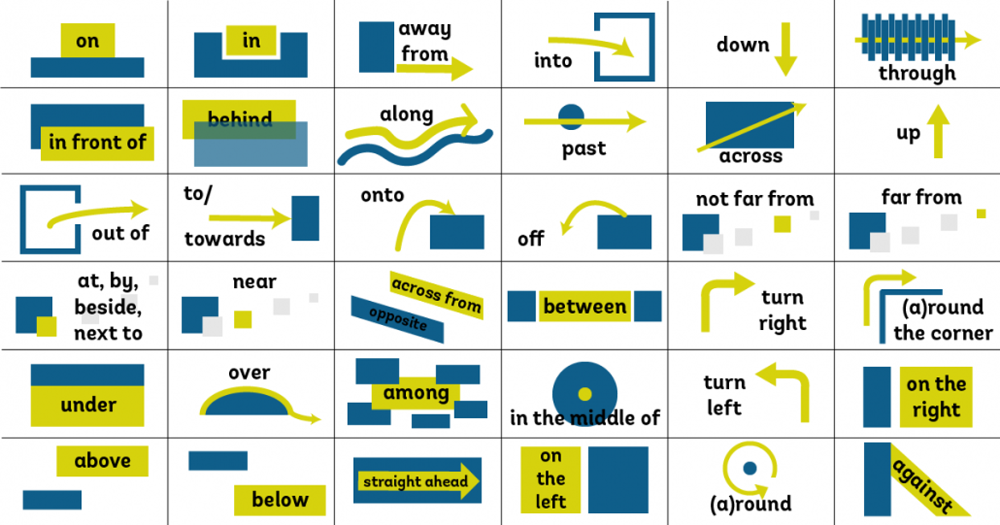

# 介词
介词有很多的用法可以充当句子中的成分,可以按结构分,按意思分

### 介词易混
* 地点(at in on)
1. at 只某个具体的地点,小地点
> example: At bus Station(在公交站)

2. in后面跟大地点
>example: in Beijing

3. on表示在上面,后面加楼层
>example: on the 1th floor(在一楼)

* 时间(at in on)
1. 后面跟具体**时刻**，一天中的具体时间点，具体的周和节日
>example: At midnight.（在午夜）

2. on后面跟具体的时间，某年某月某日星期几
>example: On Monday September 2th 2019.（在2019年9月2日星期一）

3. in后面跟年、月、早晚、季节，一段时间，将来时中表示一段时间之后
>example: In Spring（在春天）
We will meet in a few days.（我们将在几天后见面）

* 方位(on,in,to)
1. in是a在b里面
>example:Kunming lies in the southwest of China.（昆明位于中国西南部）

2. on是a和b连着
>example:Canada lies on the north of American.（加拿大位于美国北部）

3. to是a和b不连着
>example:Japan lies to the east of China.（日本位于中国东部）

4. to表示方向
>example: to the south.（向南边）

5. on表示左右
>example: on the left.（向左边）

## 介词的用法
介词不能单独使用,置于名词之前，组成表示时间、状态、目的或原因的介词短语,
所以`介词 + 名词 = 介词短语`
* worth这个词虽然查不到有介词的词性,但是通常可以充当介词来使用
    * The stamp is not worth ¥100(这张邮票并不值100元)
