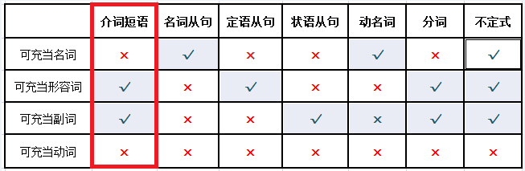

# 句子的成分总结
主谓宾就不说了,下面介绍定状补

## 定语
定语是广义的形容词,一般被翻译称.....的,但是有时候单一的词汇不能够表达复杂的应用场景,
所以可以用介词或者从句来从当句子的成分
* The cute boy speaks English(那个可爱的男孩会说英语)

## 状语
状语是广义的副词,用来修饰除名词和代词外的其它结构，
比如动词、形容词、副词、短语、句子等
* James answered in English(James 用英文回答的)
* 也可以使用句子做状语来修饰句子
    * When I had no idea，James answered(时间状语从句,修饰后面的句子)
    
## 表语
表语是紧跟系动词之后的结构,用来表达主语的身份,状态,性质等
* He looks good. （他看起来不错。）
* 特点
    * 系动词后可以跟名词和形容词
    * 将系动词替换为be动词后，句子的语义基本不会改变。

## 补语
补语是对宾语的补充说明
* 补语是句子中不可省略的成分,如果去掉,语义变得模糊不清
* 宾语和补语间加入be动词后能够构成一个完整的句子，且该句阐述的信息和原句意图表达的信息基本相同

## 补语的构成原理
* 补语是由名词从句省略得来的
    * I found that the homework was difficult
      I found the homework difficult
* 因为补语是由名词从句中的表语演变来的，
所以补语的第二个特点中才会要求先在宾语和疑似补语的结构间加入be动词
（即恢复名词从句的形态后），再来判断这个结构是不是补语

